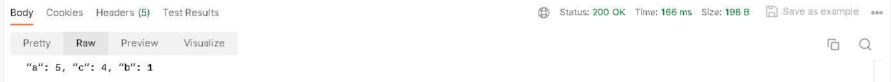
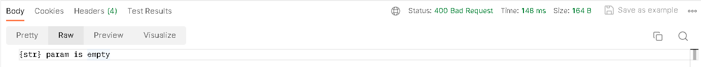

## Тестовое задание.

Спроектировать(продумать формат и ограничения входящих/исходящих параметров) и реализовать REST API, вычисляющее частоту встречи символов по заданной строке. Результат должен быть отсортирован по убыванию количества вхождений символа в заданную строку.

Пример входной строки: “aaaaabcccc”

Пример выходного результата: “a”: 5, “c”: 4, “b”: 1

Требования к решению:
1) Java 8+
2) Spring boot 2+
3) Решение должно быть покрыто тестами
4) У решения должна быть документация по запуску и формату входящих/исходящих параметров
5) Код решения необходимо разместить в публичном Github репозитории.

## Документация
Base url: http://localhost:8080/api/v1

Методы:

    1) GET /get - Вычисление частоты встречи символов в заданной строке.

Query-параметры запроса: "str" - заданная строка для которой нужно вычислить частоту встречи символов.

Response body
1) 200 OK - Строка с вычисленной частотой встречи символов отсортированная 
по убыванию кол-ва вхождения символа в строку.
2) 400 Bad Request - Если нет параметра "str", то стандартный
bad request. Если "str" пуста, то сообщение об этом. 

Примеры:

1) Happy path

Request:

Response:

2) Bad request

Request: 

Response:

